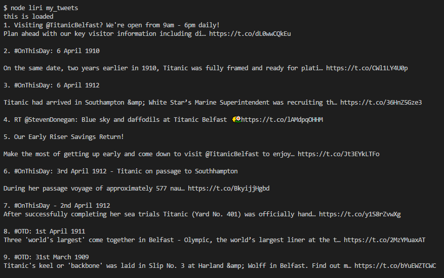
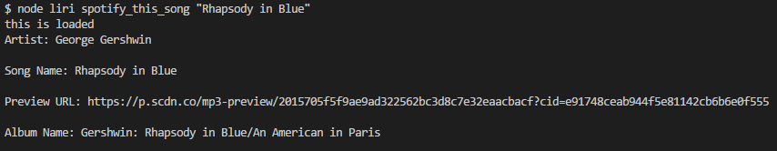
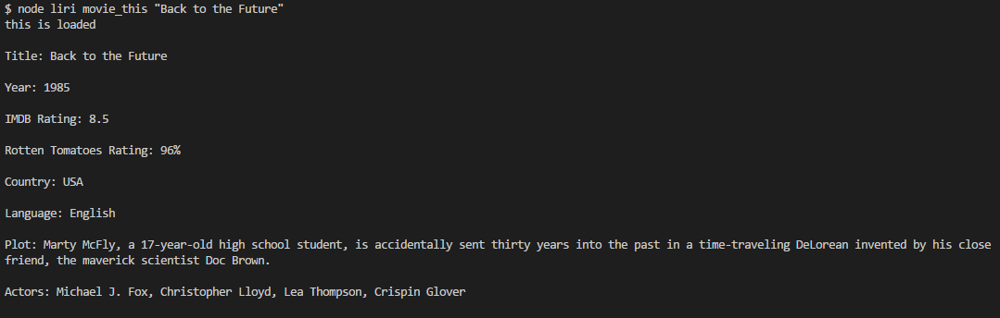

# LIRI App

An SIRI-like Node-based application which is run from the command line. It stands for Language Interpretation and Recognition Interface, and takes in parameters to give back data in the form of tweets, as well as film and music information.

## How to Use

This application works by typing "node liri" followed by one of four commands in the command line/terminal: "my_tweets", "spotify_this_song", "movie_this", and "do_what_it_says".

The "my_tweets" command returns the 20 most recent tweets from a given Twitter account, the handle/username of which is written as part of the code within the switch statement case for "my_tweets". This means that if the user wishes to change where the tweets are coming from, he or she has to remove the account that is already in the code and replace it with the account from which they want to retrieve tweets.

For the "spotify_this_song" command, the user must add the name of a song after the command (using quotation marks) in order to return information on that song from Spotify. For example, if the user wants to know information on the song "I Believe I Can Fly", he or she does so by typing the following in the command line: *node liri spotify_this_song "I Believe I Can Fly"*. This command returns the song's artist, name, sample/preview audio track link, and album name.

The "movie_this" command runs similarly to "spotify_this_song", because the user must add the name of a song after the command (using quotation marks) in order to return information on that movie from the OMDB database. For example, if the user wants to know information on the movie "Harry Potter and the Chamber of Secrets", he or she does so by typing the following in the command line: *node liri movie_this "Harry Potter and the Chamber of Secrets"*. This command returns the movie's title, year of release, rating from IMDB and Rotten Tomatoes, country of production, language, plot, and actors/actresses.

The final command of "do_what_it_says" uses the fs Node package to take the text inside of random.txt to call one of LIRI's commands. For default purposes, it should run spotify-this-song for "I Want it That Way," as follows the text in random.txt, but this can be changed to test out the feature for other commands. However, this feature is currently not working correctly.

### Prerequisites

npm [Twitter for Node.js](https://www.npmjs.com/package/twitter)

npm [Node Spotify API](https://www.npmjs.com/package/node-spotify-api)

npm [Request](https://www.npmjs.com/package/request)

npm [Dotenv](https://www.npmjs.com/package/dotenv)

In addition, API keys must be obtained from [Twitter](https://apps.twitter.com/app/new) and [Spotify](https://developer.spotify.com/my-applications/#!/). An API key for [OMDB](http://www.omdbapi.com/apikey.aspx) is part of the "movie_this" switch statement code.

### Technologies Used

Language - Javascript

Run-time system - Node.js

Package manager - NPM

Other tools, technologies, and techniques - API's (Twitter, Spotify, OMDB), Switch Statements

Text Editor - Visual Studio Code

## Preview

### Tweets from Titanic Belfast (@TitanicBelfast)
- - - -

### Song Information via Spotify about Rhapsody in Blue
- - - -

### Information about Back to the Future from OMDB
- - - -

## Contributing

Please feel free to branch off with tweaks and making a repo; open to suggestions!

## Future Development

* Making code cleaner and more efficient by writing out functions in once place, and the referencing them where needed, instead of writing them out in full throughout the code.

* Providing a default song and movie for which information will be returned when the user does not type in a song or movie with the "spotify_this_song" and "movie_this" commands.

* Getting the 'do_what_it_says' command to work.

## Authors

* **Wesley Hutchins** - [Github](https://github.com/WesPres1990)